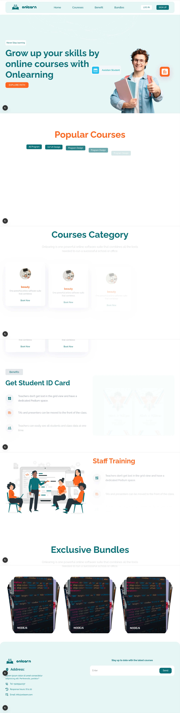
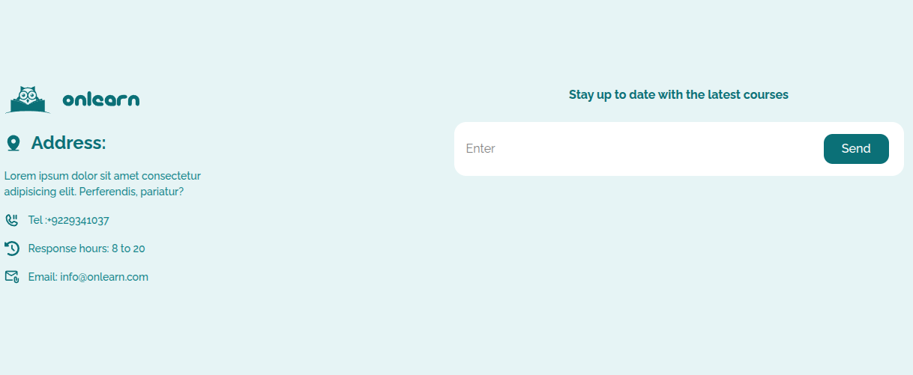
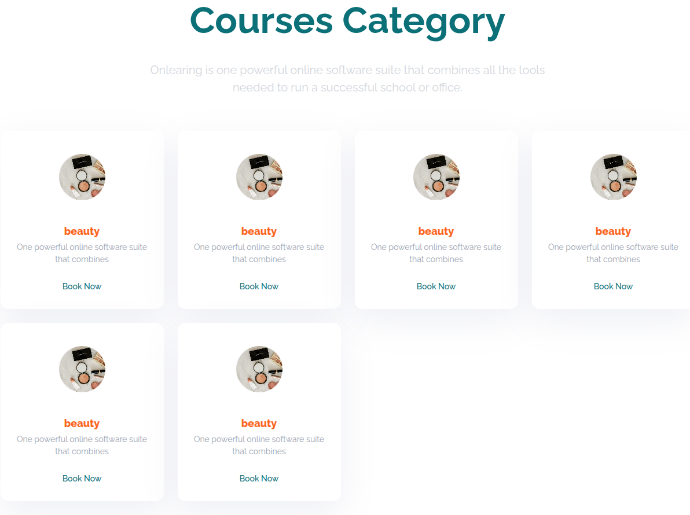
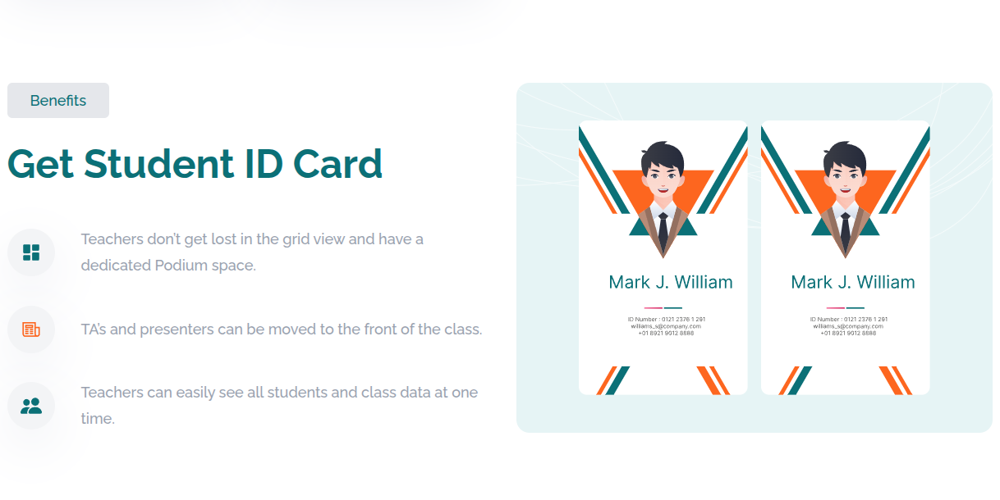
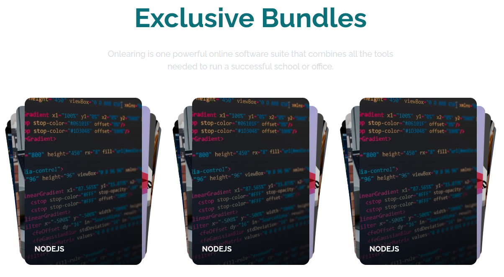
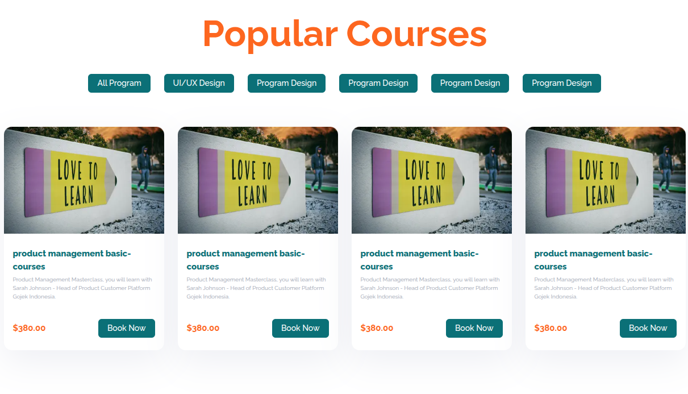

# Educational Courses Landing Page

A modern, responsive, and visually stunning landing page for an educational platform, built using **Next.js 16**, **React 19**, and **Tailwind CSS v4**.

---

## Preview & Design

### Main Preview



### Section Previews

<table width="100%">
  <tr>
    <td width="50%">
      <p align="center"><b>Header</b></p>
      
    </td>
     <td width="50%">
      <p align="center"><b>Footer</b></p>
      
    </td>
    <td width="50%">
      <p align="center"><b>Hero Section</b></p>
      
    </td>
    <td width="50%">
      <p align="center"><b>Category Courses</b></p>
      
    </td>
  </tr>
  <tr>
    <td width="50%">
      <p align="center"><b>Benefits</b></p>
      
    </td>
    <td width="50%">
      <p align="center"><b>Bundles</b></p>
      
    </td>
  </tr>
  <tr>
    <td width="50%">
      <p align="center"><b>Popular Courses</b></p>
      
    </td>
    <td width="50%">
      <p align="center"><b>Our Staff</b></p>
      
    </td>
  </tr>
</table>

---

## Key Features & Tech Details

### Advanced Styling Architectures

This project leverages **Tailwind CSS v4** combined with utility utilities to make components cleaner and fully reusable:

- **`clsx` & `tailwind-merge`**: Used together to dynamically construct and merge Tailwind classes efficiently without style conflicts.
- **`class-variance-authority` (CVA)**: Implemented specifically on the **Button UI component** to easily manage design variants (e.g., sizes, colors, outlines) via clean props mapping.

### Rich Animations & Layouts

- **`motion` (Motion Dev)**: Powers modern, physics-based smooth entrance and interaction animations across the landing page.
- **Swiper Integration**: The **Bundles Section** combines `motion` with **React Swiper** to build a highly interactive, responsive, and modern card carousel layout.

---

## Tech Stack

- **Framework:** Next.js 16.2.10 (App Router)
- **Library:** React 19.2.4
- **Styling:** Tailwind CSS v4, CVA, clsx, tailwind-merge
- **Animation & Carousel:** Motion (Framer Motion), Swiper
- **Icons:** React Icons
- **Compiler Optimization:** Babel Plugin React Compiler

---

## Getting Started

### Prerequisites

Make sure you have **Node.js** and **pnpm** installed on your machine.

### Installation

Clone the repository:

```bash
git clone <repository-url>
cd educational-courses-landing-page


Install dependencies using pnpm:
```

Bash
pnpm install
Run the development server:

Bash
pnpm dev
Open http://localhost:3000 with your browser to see the result.

Available Scripts
pnpm dev - Starts the development server.
pnpm build - Builds the application for production.
pnpm start - Starts the production server after building.
pnpm lint - Runs ESLint to check for code quality issues.

👤 Author
Hermansyah - Frontend Web Developer
